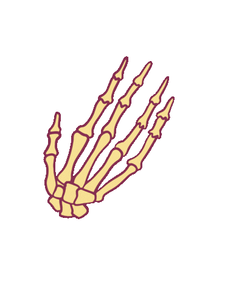

<h1 align="center">
  Hi 
  , 
  <a target="_blank" style="margin-left: 20px;" href="https://sumer5020.github.io">
    I'm Sumer Al Kadasi 
    
  </a>
</h1>
<h3 align="center">A passionate full-stack developer, interested in developing, managing websites, business support systems (BSS), databases and data analysis.</h3>

### Contact Info
- 📑 You can make discussion in:  <a target="_blank" href="https://github.com/sumer5020/sumer5020/discussions">discussions</a>
- 📫 How to reach me:  <a target="_blank" href="mailto:sumer5020@gmail.com">sumer5020@gmail.com</a>
- 

  

  Thanks :point_down: to visit my profile this year  

<!--
- 🔭 I’m currently working on ...
- 🌱 I’m currently learning ...
- 👯 I’m looking to collaborate on ...
- 🤔 I’m looking for help with ...
- 💬 Ask me about ...
- 📫 How to reach me: ...
- 😄 Pronouns: ...
- ⚡ Fun fact: ...
https://github.com/anuraghazra/github-readme-stats
-->
